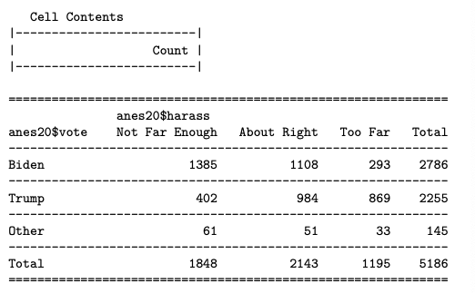
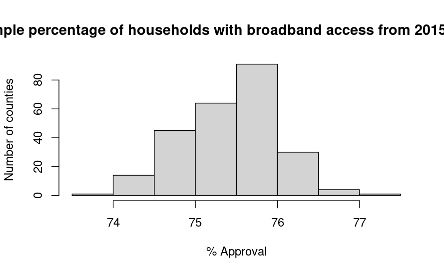

# Part 1: Concepts and Calculations

```{r}
library(descr)
library(DescTools)
library(Hmisc)
```
## 1

Use the table below, showing the joint frequency distribution for attitudes toward the amount of attention given to sexual harassment (a recoded version of anes20$V202384) and vote choice for this problem.



$\bullet$ Estimate the following probabilities:

*P(Too Far)*
```{r}
1195/5186
```

*P(About Right)*
```{r}
2143/5186
```

*P(Not Far Enough)*
```{r}
1848/5186
```

*P(Trump $\cap$ Not Far Enough)*
```{r}
402/5186
```

*P(Trump $\cup$ Not Far Enough)*
```{r}
#P(Trump) 
2255/5186
#P(Not Far Enough)
1848/5186
#P(Trump$\cap$ Not Far Enough)
402/5186
#P(Trump)+P(Not Far Enough)-P(Trump$\cap$ Not Far Enough)
(0.4348245+0.356344)-(0.07751639)
```

*P(Trump | Too Far)*
```{r}
#P(Trump $\cap$ Too Far)
869/5186
#P(Too Far)
1195/5186
#P(Trump | Too Far)
0.1675665/0.2304281
```

*P(Trump | About Right)*
```{r}
#P(Trump $\cap$ About Right)
984/5186
#P(About Right)
2143/5186
#P(Trump | About Right)
0.1897416/0.4132279
```

*P(Trump | Not Far Enough)*
```{r}
#P(Trump $\cap$ Not Far Enough)
402/5186
#P(Not Far Enough)
1848/5186
#P(Trump | Not Far Enough)
0.07751639/0.356344
```

$\bullet$ Summarize how the probability of voting for President Trump was related to how people felt about the amount of attention given to sexual harassment. 

Based on the data available and the probability estimates, we could conclude that people's sentiment regarding the amount of attention given to sexual harassment seems to be closely related to their probability of voting for President Trump. As a matter of fact, only 7.75% of the voters who said that sexual harassment's attention has not gone far enough, voted for President Trump. On the other hand, the probability that a voter either voted for Trump or answered that sexual harassment attention had "Not (gone) Far Enough" is 71.36%, meaning that the majority of the population made choices that did not intersect between one and the other. In addition, the probability that people who answered that sexual harassment attention had gone "Too Far" voted for President Trump was over 72.71%, against 45.91% of people that voted "About Right" and only 21.75% of eople who voted "Not Far Enough."

## 2

I flipped a coin 10 times and it came up Heads only twice. I say to my friend that the coin seems biased toward Tails. They say that I need to flipped it a lot more times before I can be confident that there is something wrong with the coin. I flip the coin 1000 times, and it came up Heads 510 times. Was my friend right? What principle is involved here? In other words, how do you explain the difference between 2/10 on my first set of flips and 507/1000 on my second set?

The difference between the outcome of the first try and that of the second try can be explained by the Law of Large Numbers, which dictates that "If you conduct multiple trials or experiments of a random event, the average outcome approaches the theoretical (expected) outcome as the number of trials increases and becomes large." As a result, we would have to conclude that our friend was correct, and that we needed a lot more trials in order to get a result that was closer to the actual probability of coming up with either Heads or Tails. As we increase the number of our trials, we will also get more precise results.

## 3
A group of students on a college campus are interested in how much students spend on books and supplies in a typical semester. They interview a random sample of 300 students and find that the average semester expenditure is $\$350$ and the standard deviation is $\$78$.

  a. Are the results reported above from an empirical distribution or a sampling distribution? Explain your answer.
  
  I would conclude that the result reported by this experiment come from an empirical distribution, because we have population data and we were able to interview the subjects of interest, thus collecting real world data, without having to set up an experiment or trial to gather theoretical results.
  
  b. Calculate the standard error of the mean.
```{r}
#Standard deviation = 78
#Sample size = 300
#Square root of 300
sqrt(300)
#Standard error:
78/(sqrt(300))
```
  
  
  c. Construct and interpret a 95% confidence interval around the mean amount of money students spend on books and supplies per semester.
  
```{r}
#Find critical value for z(0.95)
qnorm(.025, lower.tail = F)
#Substitute into the confidence interval equation:
#c.i(0.95)= 350 +- 1.96*4.50
1.96*4.50
#c.i(0.95)= 350 +- 8.82
#Lower limit confidence interval
350 - 8.82
#Upper limit
350 + 8.82
```
As a result, we are 95% confident that the population value for how much students spend on books and supplies in a typical semester is between the lower limit of 341.18 dollars and the upper limit of 358.82 dollars. In other words, 95% of all confidence intervals will include a value between 341.18 dollars and 358.82 dollars.

## Question 4
In the same survey used in question 3, students were asked if they were satisfied or dissatisfied with the university’s response to the COVID-19 pandemic. Among the 300 students, 55% reported being satisfied. The administration hailed this finding as evidence that a majority of students support the course they’ve taken in reaction to the pandemic. What do you think of this claim? Of course, as a bright college student in the midst of learning about political data analysis, you know that 55% is just a point estimate and you really need to construct a 95% confidence interval around this sample estimate before concluding that more than half the students approve of the administration’s actions. So, let’s get to it. (Hint: this is a “proportion” problem)

  a. Calculate the standard error of the proportion. What does this represent?
```{r}
#55% = 0.55
#Standard error
sqrt((0.55*(1-0.55)/300))
```
This represents that on average the satisfaction responses are likely to variate by 2.87% from the reported 55% satisfaction average.

  b. Construct and interpret a 95% confidence interval around the reported proportion of students who are satisfied with the administration’s actions.

```{r}
#c.i(0.95)=0.55 +- 1.96*0.0287
1.96*0.0287
#Estimate lower limit
0.55-0.056252
#Upper limit
0.55+0.056252
```
We are 95% confident that the population value for students' satisfaction with university's COVID-19 response is between the lower limit of 49.37% and the upper limit of 60.62%. Or, 95% of all confidence intervals will include a value between 49.37% and 60.62% of satisfaction responses.
 
  c. Is the administration right in their claim that a majority of students support their actions related to the pandemic?

I believe that the administration is correct, because we calculated that the responses standard deviation could differ by only 2.87% on average, and that 95% of all confidence intervals will include a proportion of students' satisfaction that varies between 49.37% and 60.62%. Both these results are still close to half the students agreeing that the university handled COVID-19 policies well, and range to a majority of them thinking so. Therefore, even if the lower limit would mean that only half of the students (not a majority) think that the university handled COVID-19 well, the upper limits include values well above half of the students, therefore leading us to cautiously agreeing with the university's claims.

# Part 2: R Problems 
For these problems, you should use the ```county20large``` data set to analyze the the distribution of internet access across U.S. counties, using ```county20large$internet```. This variable measures the percent of households with broadband access from 2015 to 2019. Remember to write a line in your markdown document that tells R where to get the data from (hint: it's in the data folder). 

```{r}
load("data/county20large.rda")
```

## 1
Describe the distribution of ```county20large$internet```, using a histogram and the mean, median, and skewness statistics. Note that since these 3142 counties represent the population of counties, the mean of this variable is the population value ($\mu$).

```{r}
hist(county20large$internet,
     main="Percentage of households with broadband access from 2015 to 2019", #Graph title 
     ylab="Number of counties", #vertical axis label
     xlab="% Approval") #Horizontal axis label
summary(county20large$internet)
Skew(county20large$internet)
```

From this variable's histogram and statistics, we can gather that the average percentage of households with broadband access from 2015 to 2019 is around 75.40% of households, with a median value of 76.46% of households. In this case, our distribution's mean is somewhat lower than its median, thus making it a negatively skewed graph. The middle 50% of the responses is situated between 70.53% (25th percentile) and 81.41% (75th percentile). The fact that the median is much closer to the 75th percentile than the 25th percentile also shows us that this distribution is quite skewed. These findings are confirmed by the histogram, where we can also gather that the values are concentrated between 70% and 85% of households, with the lowest value being 34.77% and the highest being 96.03%.

## 2
Use the code provided below to create a new object named web250 that represents a sample of internet access in 250 counties, drawn from ```county20large$internet```.
```{r, eval=FALSE}
load("data/county20large.rda")
set.seed(251)
web250 <- rep(NA, 250)
for(i in 1:250){
web250_samp <- sample(county20large$internet, 250)
web250[i] <-  mean((web250_samp), na.rm=T)
}
```

## 3
Once you’ve generated your sample, describe the distribution of ```web250``` using a histogram and the sample mean. How does this distribution compare to population values you produced in Question 1?

```{r, eval=F}
hist(web250,
     main="Sample percentage of households with broadband access from 2015 to 2019", #Graph title 
     ylab="Number of counties", #vertical axis label
     xlab="% Approval") #Horizontal axis label
summary(web250)
```




From this sample's histogram and statistics, we can gather that the average percentage of households with broadband access from 2015 to 2019 is around 75.43% of households, with a median value of 75.51% of households. These values are very similar to the values gathered from the population statistics. In this case, as well as the previous one, our distribution's mean is somewhat lower than its median, thus making it a negatively skewed graph. The middle 50% of the responses, in this sample, is situated between 75.05% (25th percentile) and 75.87% (75th percentile). This also shows us that this distribution is lightly skewed, just as the population data, although by much smaller amounts. The histogram confirms these findings, although with a more concentrated number of percentages, ranging from 74% to 77%.

## 4
Create a new object that represents a sample of internet access rates in 750 counties, drawn from ```county20large$internet```. Name this object ```web750```. Describe the distribution of ```web750``` using a histogram and the sample mean. How does this distribution compare to population values you produced in question 1? Does it resemble the population more closely than the distribution of ```web250``` does? If so, in what ways?

```{r}
set.seed(750)
web750 <- rep(NA, 750)
for(i in 1:750){
samp <- sample(county20large$internet, 750)
web750[i] <-  mean((samp), na.rm=T)
}

hist(web750,
     main="Sample percentage of households with broadband access from 2015 to 2019", #Graph title 
     ylab="Number of counties", #vertical axis label
     xlab="% Approval") #Horizontal axis label
summary(web750)
```

From this sample's histogram and statistics, we can gather that the average percentage of households with broadband access from 2015 to 2019 is around 75.40% of households, with a median value of also 75.40% of households. The mean value is equal to the mean value found by calculating data from the population statistics. In this case, as well as the previous one, our distribution's mean is equal to its median, thus making it different from both the population histigram and data, which was negatively skewed, as well as the data gathered from the sample of 250 households. The middle 50% of the responses, in this sample, is situated between 75.22% (25th percentile) and 75.58% (75th percentile). This shows us that by increasing the sampling outcomes, the variance of the responses becomes increasingly smaller. However, both samplings have very different minimum and maximum values than the original population data.

## 5
Use R commands to produce the standard errors and 95% confidence intervals for both ```web250``` and ```web750```. Use words to interpret the substantive meaning of both confidence intervals? How are the confidence intervals and standard errors in these two samples different from each other? How do you explain these differences?

```web250```
```{r}
#75.43% = 0.7543
#Standard error
sqrt((0.7543*(1-0.7543)/250))
#c.i(0.95)=0.7543 +- 1.96*0.0272273
1.96*0.0272273
#Estimate lower limit
0.55-0.05336551
#Upper limit
0.55+0.05336551
```
We are 95% confident that the population value for the percentage of households that had internet access between 2015 and 2019, gathered from our genereated sample of 250 hosueholds, is between the lower limit of 49.66% and the upper limit of 60.33%. Or, 95% of all confidence intervals will include a value between 49.66% and 60.33% of households with access.

```web750```
```{r}
#75.40% = 0.7540
#Standard error
sqrt((0.7540*(1-0.7540)/750))
#c.i(0.95)=0.7540 +- 1.96*0.01572616
1.96*0.01572616
#Estimate lower limit
0.55-0.03082327
#Upper limit
0.55+0.03082327
```

We are 95% confident that the population value for the percentage of households that had internet access between 2015 and 2019, gathered from our genereated sample of 750 households, is between the lower limit of 51.91% and the upper limit of 58.08%. Or, 95% of all confidence intervals will include a value between 51.91% and 58.08% of households with access.

As we can see from our calculations, the standard error of web250 is much larger (27.22%) than that of web750 (15.72%). At the same time, web250's 95% confidence intervals have greater variance than web750's. This is because, as the Law of Large Numbers explains, as we increase our sample generated answers, they will ultimately approach our populations' predicted probability values.