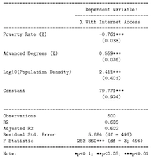

# Part 1: Concepts and Calculations

## 1

The regression model below focuses on multiple explanations for county-level differences in internet access, using a sample of 500 counties. The independent variables are the percent of the county population living below the poverty rate, the percent of the county population with advanced degrees, and the logged value of population density.



$\bullet$ Interpret the slope for poverty rate

As the percent of the county population living below the poverty rate increases by 1%, the percentage of county population with internet access will decrease by 0.761 percentage points.

$\bullet$ Interpret the slope for advanced degrees

As the percent of the county population with advanced degrees increases by 1%, the percentage of county population with internet access will increase by 0.559 percentage points.

$\bullet$ Interpret the slope for the log of population density

As the county's population density increases by 1 unit, the percentage of county population with internet access will increase by 2.411 percentage points or 24.11%. (If I am remembering correctly when the independent is logged we should multiply the coefficient by 10 in order to interpret it?)

$\bullet$ Evaluate the fit of the model in terms of explained variance

The R-squared for this model is 0.605 and the adjusted R-squared is 0.602. This means that our independent variables explain 60.5%-60.2% of the variation in our dependent variable. This is a good result because this means that our model is a good fit and it explains a good portion of our dependent variable.

$\bullet$ What is the typical error in the model? Does that seem like a small or large amount of error?

The residual standard error in the model is 5.684, which if we compare it to our dependent variable, percentage of county population with internet access, is quite a small amount of error. However, the residual standard error in and of itself has no standard meaning, so it is up for interpretation what the true magnitude of this result is.

## 2

Use the information from the model in Question 1 along with the information presented below to generate predicted outcomes for the two hypothetical counties, County A and County B. 


County | Poverty Rate | Adv. Degrees | Log10(Density) | Prediction?
------ | ------------ | ------------ | -------------- | -----------
A      | 19           | 4            | 1.23           |
B      | 11           | 8            | 2.06           |          

$\bullet$ Prediction of County A: 

```{r}
countyA<- 79.771-0.761*19+0.559*4+2.411*1.23
countyA
```

$\bullet$ Prediction of County B: 

```{r}
countyB<- 79.771-0.761*11+0.559*8+2.411*2.06
countyB
```

$\bullet$ What did you learn from predicting these hypothetical outcomes that you could not learn from the model output?

From predicting the hypothetical outcomes, I was able to realize that the poverty rate in county B is lower then the poverty rate in county A (11% as opposed to 19%). In addition, the percent of advanced degrees in county B is also higher then that of county A (8% versus 4%). The log of density is also higher in county B.
This could mean that county B is better well-off than county A, since it has a lower poverty rate and a greater percentage of citizens with advanced degrees. However, since the population density for county B is higher than county A, we could also hypothesize that county B is perhaps near a city center, or somewhere where population density would be higher. In contrast, county A might be a more isolated, spread out county, with lower population density.
The fact that county B is better well-off than county A is also reflected by our estimation results, which show that county B has a 80% internet access rate as opposed to 70% for county A.

# Part II: R Problems

## 1

Use the ```states20``` data set and run a multiple regression model with infant mortality (infant_mort) as the dependent variable, and per capita income (PCincome2020), the teen birth rate (teenbirth), and percent low birth weight births lowbirthwt as the independent variables. 

```{r}
load("data/states20.rda")
rhmwrk<-lm(states20$infant_mort~states20$PCincome2020 + states20$teenbirth + states20$lowbirthwt,na.action=na.exclude)
rhmwrk
```

Then, produce a readable table using ```stargazer``` (already installed - you just need to load it into your library) and answer the following:

$\bullet$ Using the results of this regression model, discuss the determinants of infant mortality in the states. Pay special attention to the direction and statistical significance of the slopes, and to all measures of model fit and accuracy.

```{r}
#table
library(stargazer)
stargazer(rhmwrk, type="text",
dep.var.labels=c("Infant Mortality"),
covariate.labels = c("Per Capita Income","Teen Birth Rate","Percent of Low Births Birth Weight"))

```
From our regression, we can determine that infant mortality is strongly related with per capita income, teen birth rate and the percentage of low birth births weight. As per capita income increases by one unit (or dollar, we could assume), infant mortality decreases by 0.00002 percentage points. Even if our coefficient does not have a high magnitude, it is still statistically significant at the 5% significance level, and therefore it shows a negative relationship between the dependent and independent variables. The coefficient for teen birth rate is 0.071, which means that as teen birth rate increases by 1%, infant mortality increases by 7.1 percentage points. This result is statistically significant at the 5% significance level, and also demonstrates a strong positive relationship between the independent and the dependent. Lastly, as percent of low birth weights increases by 1%, infant mortality increases by 31.2 percentage points. This result is significant at the 10% significance level, and also shows a strong, positive relationship between the two variables. The R-squared for this model is 0.643 and the adjusted R-squared is 0.620, which can be interpreted as follows: 64.3% or 62% of the variation in our dependent, infant mortality, can be explained by our three independent variables. These confirm our hypothesis that these variables have a strong correlation. The residual standard error is 0.706, which, if we interpret it based on our dependent variables infant mortality, we could conclude that there is not much error in our regression.


## 2

Use the following command to generate predicted values of infant mortality in the states from the regression model produced in problem 1. 

Now, produce a scatterplot of predicted and actual levels of infant mortality and replace the scatterplot markers with state abbreviations. Make sure this scatterplot includes a regression line showing the relationship between predicted and actual values. Generally, does it look like there is a good fit between the model predictions and the actual levels of infant mortality? Explain. Identify states that stand out as having substantially higher or lower than expected levels of infant mortality.

```{r}
#generate predicted values
states20$yhat<-predict(rhmwrk)
```

```{r}
#Use predicted values as an independent variable in the scatterplot
plot(states20$yhat,states20$infant_mort,
xlab="Predicted Infant Mortality",
ylab ="Actual Infant Mortality", cex=.4)

abline(lm(states20$infant_mort~states20$yhat))

#State abbreviations
text(states20$yhat, states20$infant_mort, states20$stateab, cex=.7)
```
From the plot, it looks like there is a good fit between the model predictions and the actual levels of infant mortality. While plotting it, the expected outcomes for predicted and actual values were overlapping each other with good precision. In addition, the values are concentrated around the regression line, and follow the same upward sloping trend as the regression line, which also points out to the two values being a good fit. Looking at the plot we can observe that Hawaii, Rhode Island and New Mexico stand out as having substantially lower than predicted infant mortality. On the other hand, Maine, Oklahoma and Alabama stand out as having higher than predicted infant mortality.
