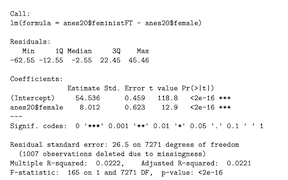
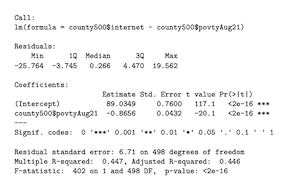

# Part 1: Concepts and Calculations

## 1
Identify the parts of this regression equation: $\hat{y} = a + b_1x$

$\bullet$ The independent variable is: $x$

$\bullet$ The slope is: $b_1$

$\bullet$ The constant is: $a$

$\bullet$ The dependent variable is: $\hat{y}$

## 2

The regression output below is from the 2020 ANES and shows the impact of respondent sex (0=male, 1=female) on the Feminist feeling thermometer rating.

$\bullet$ Interpret the coefficient for anes20$female

When the respondent is a woman, their Feminist Feeling Thermometer Rating will go up by 8.012 units as compared to men.

$\bullet$ What is the average Feminist feeling thermometer rating among female respondents?

```{r}
y <- 54.536 + 8.012*1 
y
```
The average Feminist Feeling Thermometer Ratio among female respondents is 62.548 points. 

$\bullet$ What is the average Feminist feeling thermometer rating among male respondents?

```{r}
y1 <- 54.536 + 8.012*0
y1
```

The average Feminist Feeling Thermometer Ratio among male respondents is 54.536 points. 

$\bullet$ Is the relationship between respondent sex and feelings toward feminists strong, weak, or something in between? 

In order to judge the magnitude of the relationship between respondent sex and feelings toward feminists we can look at the R-squared and adjusted R-squared values. In this case, the R-squared is 0.0222 and the adjusted R-squared is 0.0221. This means that 2.22% and 2.21% of the variation in our dependent variable, feelings toward feminists, is explained by the independent variable, gender. Furthermore, we can convert it to a correlation coefficient:

```{r}
sqrt(0.0222)
```

I would say that this is not a strong relationship because only a very small amount of our dependent (2.21%) can be explained by solely taking into consideration our one independent variable. In addition, the correlation coefficient between the two variables is 0.14, which also does not indicate a strong relationship.



## 3

The regression model below summarizes the relationship between the poverty rate and the percent (0 to 100, not 0 to 1) of households with access to the internet in a sample of 500 U.S. counties.

$\bullet$ Write out the results as a linear model (see question 1 for a generic version of the linear model)

$\hat{internetaccess} = 89.0349-0.8656povertyrate$

$\bullet$ Interpret the coefficient for the poverty rate.

If the poverty rate goes up by one percentage unit, the percent of households with access to the internet will go down by 86.56%.

$\bullet$ Interpret the R2 statistic

44.7% of the variation in our dependent variable, the percentage of households with access to the internet, can be explained by our independent variable, poverty rate. 

$\bullet$ What is the predicted level of internet access for a county with a 5% poverty rate?

```{r}
y2 <- 89.0349-0.8656*5
y2
```
The predicted level of internet access for a county with a 5% poverty rate is 84.7069%.

$\bullet$ What is the predicted level of internet access for a county with a 15% poverty rate?

```{r}
y3 <- 89.0349-0.8656*15
y3
```
The predicted level of internet access for a county with a 15% poverty rate is 76.0509%.

$\bullet$ Is the relationship between poverty rate and internet access strong, weak, or something in between? Explain your answer.

The R-squared is 0.447, which can be interpreted as thay 44.7% of the variation in our dependent variable, the percentage of households with access to the internet, can be explained by our independent variable, poverty rate. There is a moderate relationship between the two variables. Furthermore, when converting it to a correlation coefficient:

```{r}
sqrt(0.447)
```

I would say that this is fairly moderate relationship because a quite significant amount of our dependent can be explained by taking into consideration our independent variable. In addition, the correlation coefficient between the two variables is 0.66, which also indicates a strong relationship.



# R Problems

## 1

Produce a scatterplot showing the relationship between the percent of births to teen mothers (```states20$teenbirth```) and infant mortality ```states20$infant_mort``` in the states (infant mortality is the dependent variable). Run a regression model using the same two variables. 

```{r}
load("data/states20.rda")
library(DescTools)
library(descr)

#regression
inf_mort<-lm(states20$infant_mort ~ states20$teenbirth)

#scatterplot
plot(states20$teenbirth, states20$infant_mort,
xlab="Percent of Births to Teen Mothers",
ylab="# Infant Deaths per 1000 live Births", cex=.01)
#Add regression line
abline(inf_mort)
#Add State abbreviations
text(states20$teenbirth, states20$infant_mort, states20$stateab, cex=.7)

#View results
summary(inf_mort)

```
States that stand out as having higher than expected infant mortality (farthest above the regression line), given their percent of births to teen mothers are Alabama, Georgia, Mississipi, Oklahoma, Georgia and Maine. States with lower than expected infant mortality (farthest below the regression line) are Texas, New Mexico, California and Hawaii. We cannot deduct what pattern there might be between these states that leads to either high or low values of infant mortality, however, a relevant number of southern states has signfiicantly high percentages of infant mortality deaths.
From the graph of infant mortality on the percentage of births to teen mothers, we can see that the relationship between the two variables is significantly positive, since the lower right and upper left corners of the graph are empty of any values. This is confirmed by the regression results, since the estimated coefficient of states20$teenbirth is positive: 4.378. This can be interpreted as that if the percent of births to teen mothers goes up by 1%, infant mortality will go up by 4.378 units. In percentage, that would be 437.8%. The Adjusted R-squared is 0.5342, which can be interpreted as that 53.42% of the variation in our dependent variable, infant mortality, can be explained by our independent variable, percentage of births to teen mothers. There is a strong relationship between the two variables. Furthermore, when converting it to a correlation coefficient:

```{r}
sqrt(0.5342)
```

I would say that this is a very strong relationship because a quite significant amount of our dependent (53.42%) can be explained by our independent variable. In addition, the correlation coefficient between the two variables is 0.73, which also indicates a very strong relationship.

## 2

Repeat the same analysis from the previous question (1), except now use ```states20$lowbirthwt``` (% of births that are technically low birth weight) as the independent variable.

```{r}

#regression
lowbirth_infmort<-lm(states20$infant_mort ~ states20$lowbirthwt)

#scatterplot
plot(states20$lowbirthwt, states20$infant_mort,
xlab="Percent of Low Birth Weights",
ylab="# Infant Deaths per 1000 live Births", cex=.01)
#Add regression line
abline(lowbirth_infmort)
#Add State abbreviations
text(states20$lowbirthwt, states20$infant_mort, states20$stateab, cex=.7)

#View results
summary(lowbirth_infmort)

```
States that stand out as having higher than expected infant mortality, given their percent of low birth weights, are Alabama, Oklahoma, Alaska, and Maine. States with lower than expected infant mortality are Colorado, Rhode Island, New Jersey, Hawaii and California. There might be a correlation between states with higher incomes and lower infant mortality, however, more information is needed for further proof.

From the graph of infant mortality on the percentage of low birth weights, we can see that the relationship between the two variables is significantly positive, since the lower right and upper left corners of the graph are empty of any values. This is confirmed by the regression results, since the estimated coefficient of states20$lowbirthwt is positive:  0.6148. This can be interpreted as that if the percent of low birth weights goes up by 1%, infant mortality will go up by 0.6148 units. In percentage, that would be 61.48%. The Adjusted R-squared is 0.3991, which can be interpreted as that 39.91% of the variation in our dependent variable, infant mortality, can be explained by our independent variable, percentage of low birth weights. We can therefore conclude that there is a moderate relationship between the two variables. Furthermore, when converting it to a correlation coefficient:

```{r}
sqrt(0.3991)
```

I would say that this is a strong relationship because a quite significant amount of our dependent (39.91%) can be explained by our independent variable. In addition, the correlation coefficient between the two variables is 0.63, which is quite high, and also indicates a very strong relationship.